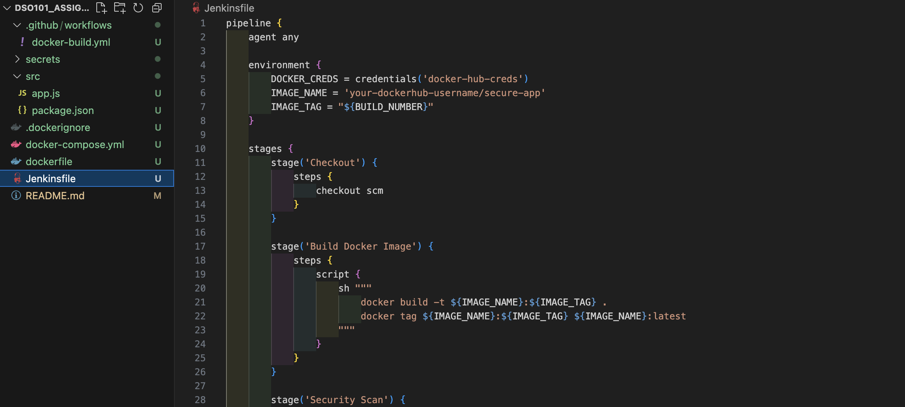
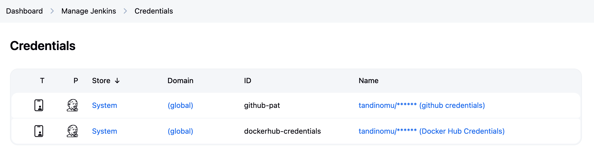

# Secure CI/CD Pipeline Implementation Guide

## Objective

Implement secure CI/CD pipelines using Docker, Jenkins, and GitHub Actions with the following security best practices:

- Create non-root user in Docker containers
- Use Docker secrets for sensitive information
- Store credentials securely in Jenkins and GitHub Actions
- Deploy Docker images to Docker Hub using secure pipelines


## Step 1: Create a Simple Application

First, let's create a simple Node.js application as an example:



## Step 2: Create Secure Dockerfile

#### Dockerfile

#### .dockerignore


## Step 3: Docker Secrets Implementation

Create a secrets directory and add dummy secret files:
```bash
mkdir secrets
echo "dummy_db_password" > secrets/db_password.txt
echo "dummy_api_key" > secrets/api_key.txt
```

## Step 4: Jenkins Pipeline

#### Jenkinsfile

## Step 5: GitHub Actions Workflow

## Step 6: Configuration Files

#### .gitignore

## Step 7: Setup Instructions

### For Jenkins:
1. Install Docker plugin
2. Add Docker Hub credentials:
   - Go to Jenkins → Manage Jenkins → Manage Credentials
   - Add new Username/Password credential
   - ID: `docker-hub-creds`



### For GitHub Actions:
1. Go to the repository → Settings → Secrets and variables → Actions
2. Add the following secrets:
   - `DOCKERHUB_USERNAME`: Your Docker Hub username
   - `DOCKERHUB_TOKEN`: Your Docker Hub access token


### Docker Hub Access Token:
1. Log in to Docker Hub
2. Go to Account Settings → Security
3. Create a new access token
4. Use this token instead of password

## Step 8: Testing

### Local Testing:
```bash
# Build the image
docker build -t secure-app .

# Run the container
docker run -p 3000:3000 secure-app

# Test the application
curl http://localhost:3000
curl http://localhost:3000/health
```

### Security Verification:
```bash
# Check that the container runs as non-root
docker run secure-app id

# Scan for vulnerabilities (if you have Trivy installed)
trivy image secure-app
```

## Security Best Practices Implemented

1. **Non-root user**: Container runs as `appuser` (UID 1001)
2. **Secrets management**: Docker secrets for sensitive data
3. **Minimal base image**: Using Alpine Linux
4. **Security scanning**: Trivy integration
5. **Credential management**: Jenkins credentials and GitHub secrets
6. **Multi-stage deployment**: Only deploy from main branch
7. **Health checks**: Built-in health endpoint
8. **Clean builds**: .dockerignore to exclude unnecessary files

## Deliverables for Assignment

Your README.md should include:
1. Screenshots of successful Jenkins pipeline runs
2. Screenshots of successful GitHub Actions workflow runs
3. Docker Hub showing the pushed images
4. Explanation of security measures implemented
5. Instructions for running the application

This implementation covers all the requirements in your assignment while following industry best practices for secure CI/CD pipelines.