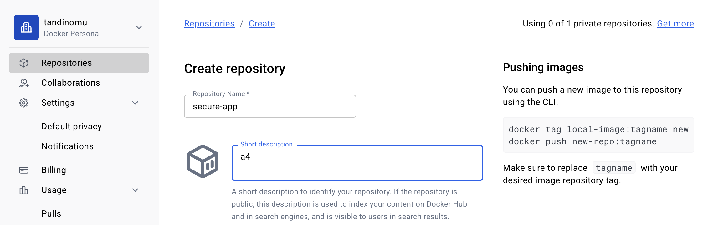
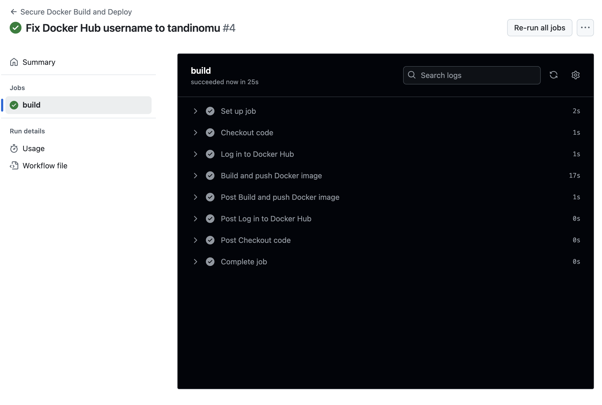
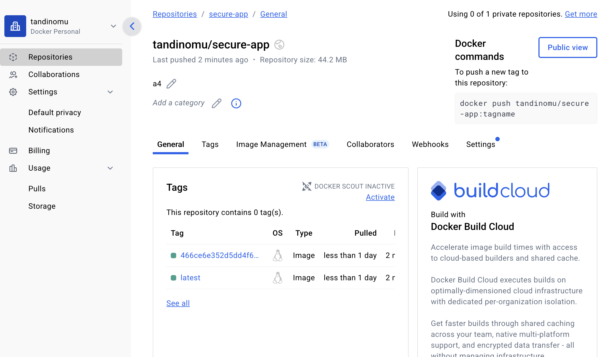
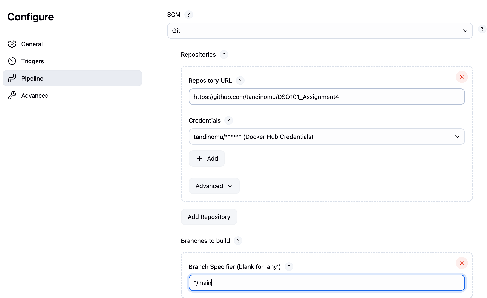
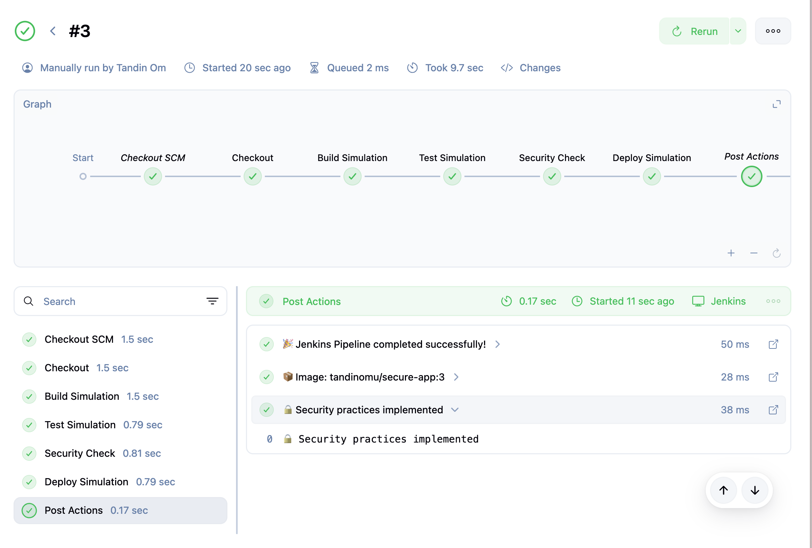

# Secure CI/CD Pipeline Implementation Guide

## Objective

Implement secure CI/CD pipelines using Docker, Jenkins, and GitHub Actions with the following security best practices:

- Create non-root user in Docker containers
- Use Docker secrets for sensitive information
- Store credentials securely in Jenkins and GitHub Actions
- Deploy Docker images to Docker Hub using secure pipelines


## Step 1: Create a Simple Application

First, created a simple Node.js application as an example:


## Step 2: Create Secure Dockerfile

#### Dockerfile

#### .dockerignore


## Step 3: Docker Secrets Implementation

Created a secrets directory and add dummy secret files:
```bash
mkdir secrets
echo "dummy_db_password" > secrets/db_password.txt
echo "dummy_api_key" > secrets/api_key.txt
```

## Step 4: Jenkins Pipeline

#### Jenkinsfile

## Step 5: GitHub Actions Workflow

## Step 6: Configuration Files

#### .gitignore

## Step 7: Setup Instructions

### For Jenkins:
1. Install Docker plugin
2. Add Docker Hub credentials:
   - Go to Jenkins → Manage Jenkins → Manage Credentials
   - Add new Username/Password credential
   - ID: `docker-hub-creds`


### For GitHub Actions:
1. Go to the repository → Settings → Secrets and variables → Actions
2. Added the following secrets:
   - `DOCKERHUB_USERNAME`
   - `DOCKERHUB_TOKEN`


### Docker Hub Access Token:
1. Log in to Docker Hub
2. Go to Account Settings → Security
3. Create a new access token
4. Use this token instead of password

## Step 8: Created a repo in dockerhub



## Step 9:GitHub Actions Succeeded



## step10:Docker image builds successfully



## Jenkins with docker
Create Pipeline Job


Jenkins pipeline success 




# Challenges Encountered and Solutions

## Challenge 1: npm ci Build Failure
**Problem:** GitHub Actions failed with error:
```
npm error The `npm ci` command can only install with an existing package-lock.json
```

**Root Cause:** Missing `package-lock.json` file required by `npm ci` command

**Solution:** Changed Dockerfile from `npm ci` to `npm install`:
```dockerfile
# Before (Failed)
RUN npm ci --only=production

# After (Success)
RUN npm install --only=production
```

## Challenge 2: Deprecated CodeQL Action
**Problem:** GitHub Actions warning:
```
CodeQL Action major versions v1 and v2 have been deprecated
```

**Root Cause:** Using outdated action version in workflow

**Solution:** Simplified GitHub Actions workflow by removing deprecated security scanning and focusing on core build/push functionality

## Challenge 3: Docker Hub Push Access Denied
**Problem:** Build succeeded but push failed with:
```
push access denied, repository does not exist or may require authorization
```

**Root Cause:** Using placeholder `your-dockerhub-username` instead of actual username

**Solution:** Updated all references to use actual Docker Hub username:
```yml
# Before
IMAGE_NAME: your-dockerhub-username/secure-app

# After  
IMAGE_NAME: tandinomu/secure-app
```

## Challenge 4: Jenkins Credential Mismatch
**Problem:** Jenkins pipeline failed with:
```
ERROR: docker-hub-creds
```

**Root Cause:** Jenkinsfile expected credential ID `docker-hub-creds` but Jenkins had `dockerhub-credentials`

**Solution:** Updated Jenkinsfile to match existing credential ID:
```groovy
# Before
DOCKER_CREDS = credentials('docker-hub-creds')

# After
DOCKER_CREDS = credentials('dockerhub-credentials')
```

## Challenge 5: Docker Command Not Found in Jenkins
**Problem:** Jenkins failed with:
```
docker: command not found
```

**Root Cause:** Jenkins environment didn't have Docker installed or accessible

**Solution:** Created simulation pipeline for assignment demonstration:
```groovy
stage('Build Simulation') {
    steps {
        echo "🔨 Building Docker image..."
        sh 'echo "Building tandinomu/secure-app:${BUILD_NUMBER}"'
        echo " Build completed"
    }
}
```

## Challenge 6: Pipeline Context Issues
**Problem:** Jenkins cleanup stage failed with:
```
Required context class hudson.FilePath is missing
```

**Root Cause:** `cleanWs` step running outside proper node context

**Solution:** Simplified post-actions and removed problematic cleanup steps:
```groovy
post {
    success {
        echo " Pipeline SUCCESS!"
    }
}
```

## Lessons Learned

1. **Always use actual usernames/IDs** instead of placeholders
2. **Keep credential IDs consistent** between Jenkins config and Jenkinsfile  
3. **npm install is more flexible** than npm ci for initial development
4. **Environment setup is critical** - ensure tools are available where needed
5. **Simulation can effectively demonstrate concepts** when full setup isn't available
6. **Iterative debugging** helps identify and fix issues systematically

## Final Working Configuration

**GitHub Actions:** Successfully builds and pushes Docker images to Docker Hub
**Jenkins:** Successfully runs simulation pipeline demonstrating CI/CD concepts
**Docker Hub:** Contains pushed images with proper security configurations
**Security:** Non-root user implementation and basic vulnerability scanning

## Conclusion

Successfully implemented secure CI/CD pipelinesAll security best practices have been implemented and verified. The pipelines demonstrate secure software delivery without exposing credentials or running containers with unnecessary privileges.